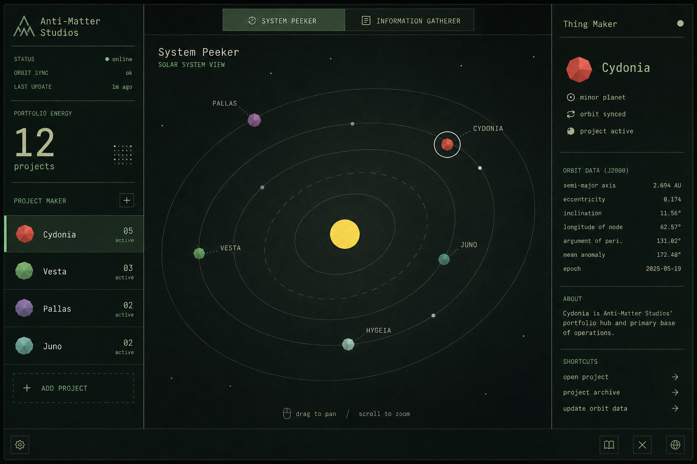
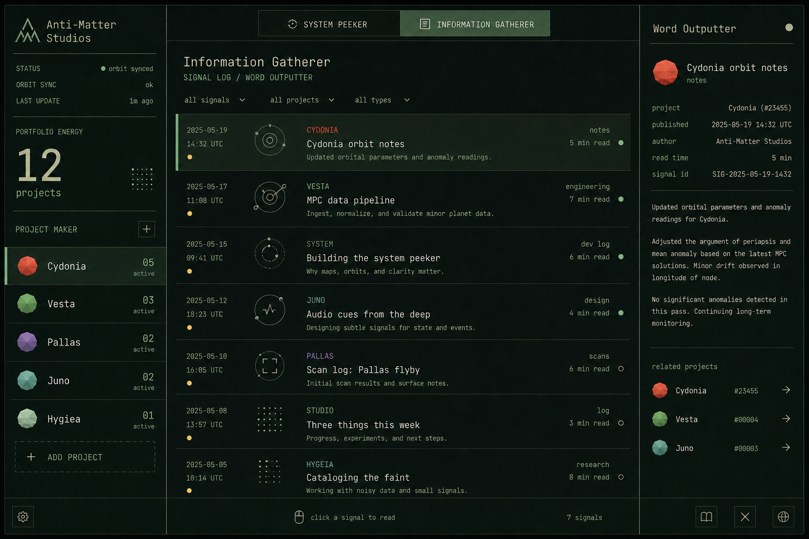
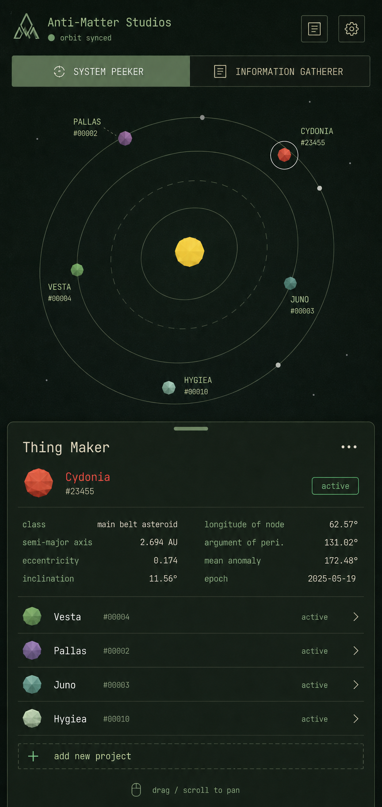
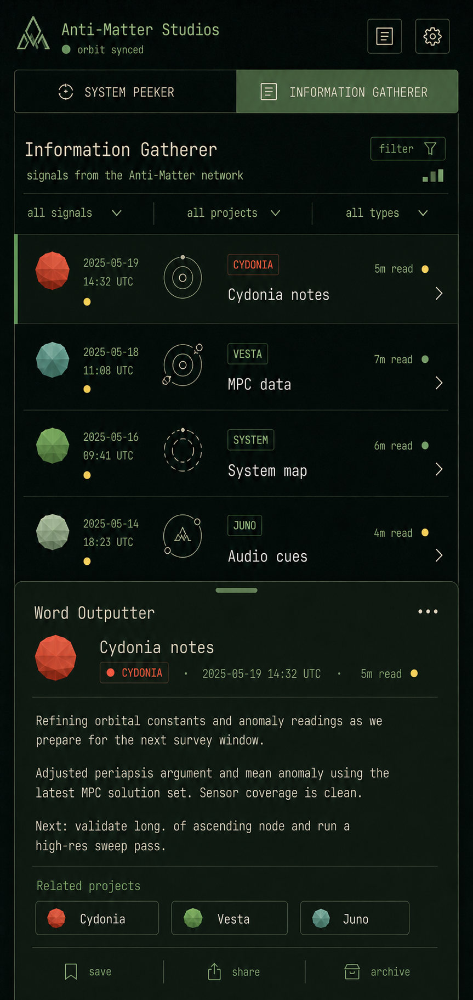

# Moodboard

This document captures the taste, references, and boundaries for the Anti-Matter Studios portfolio.

## UI Examples

### Desktop View

### Mobile View

## Core Inspirations

### Spaceplan

What to borrow:

- Minimal space UI with strong contrast.
- A playful relationship between science, absurdity, and progress.
- Small luminous objects as primary interaction targets.
- Interface density that feels game-like without becoming noisy.
- A sense that clicking into a system reveals hidden machinery.

What not to borrow:

- Do not copy its exact typography, copywriting style, iconography, or layouts.
- Do not make the portfolio feel like an idle clicker.

### Outer Wilds

What to borrow:

- Wonder through navigation rather than exposition.
- Audio as a spatial and emotional guide.
- Warmth inside a cold solar-system setting.
- Discovery cues that feel human and handmade.
- The feeling that every body has a story.

What not to borrow:

- Do not use its music, melodies, sound effects, instrument phrases, planets, symbols, or UI.
- Avoid direct banjo/whistle motif references that read as imitation.

### Minor Planet Center / Astronomical Tools

What to borrow:

- Ephemeris-like precision.
- Object designations, epochs, orbital elements, and provenance.
- A feeling of real observed objects, not decorative planets.
- Sparse technical metadata that rewards curiosity.

Reference sources:

- MPC Services: https://docs.minorplanetcenter.net/services/
- MPC Explorer: https://data.minorplanetcenter.net/explorer/
- MPC Orbits API: https://docs.minorplanetcenter.net/mpc-ops-docs/apis/get-orb/
- MPC_ORB JSON format: https://docs.minorplanetcenter.net/mpc-ops-docs/orbits/mpc-orb-json/

## Visual Direction

- Background: near-black space, subtle star density, not a flat navy wash.
- Primary marks: orbit paths, minor-planet points, current-position glows, selection rings.
- Accent families: solar amber, comet cyan, telemetry green, instrument white, alert coral.
- Typography: precise, compact, readable; mix a clean UI face with a restrained technical/mono face.
- Motion: slow orbital drift, camera ease, parallax depth, selection pulses.
- Data display: small labels, inspector panels, orbital element readouts, timestamps.

The first impression should be: "This is a real little solar system, and each object is a project."

## Audio Direction

- Original atmospheric bed, very sparse.
- Short selection cues for hover/focus/select.
- Gentle discovery stingers when opening a project for the first time.
- Optional proximity cues when navigating between bodies.
- Use warm organic sources, soft synths, tape-like texture, and filtered noise.
- Keep cues short, rare, and user-controlled.

## Interaction Feel

- The user should be able to pan, zoom, select a body, and open a project quickly.
- Project detail panels should feel like instrument readouts with human notes.
- Time controls can let users scrub or accelerate orbital movement.
- The UI should reward exploration, but the portfolio must remain easy to scan.

## Anti-Patterns

- Generic sci-fi dashboard clutter.
- Fullscreen marketing hero with no usable app.
- Fake planets placed by taste when MPC data exists.
- Loud autoplay audio.
- Dark blue monotone palette.
- Decorative gradient orbs unrelated to actual bodies.
- Long explanatory onboarding copy.
